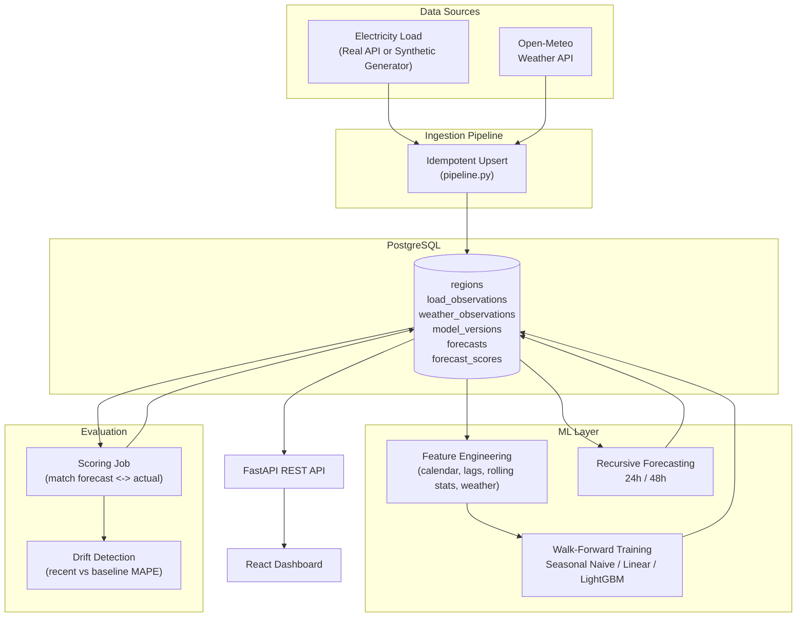
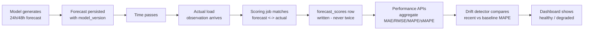
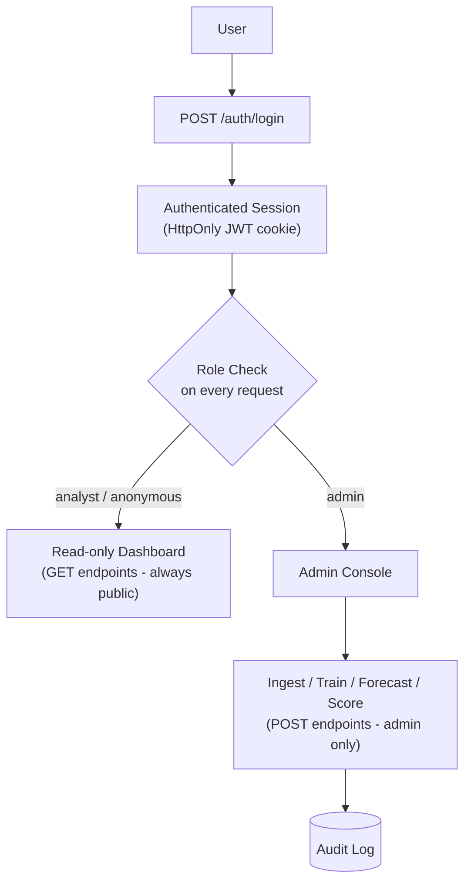

# GridCast

**Electricity Load Forecasting & Real-Time Model Evaluation Platform**

This is not just a forecasting model. It is a system that continuously generates predictions, persists them, evaluates them when actual observations arrive, and monitors whether model accuracy degrades over time.

GridCast ingests electricity demand and weather data, trains and version-controls multiple forecasting models, produces 24h/48h ahead forecasts, scores every forecast against reality as it arrives, and surfaces all of it — forecasts, errors, model comparisons, drift — in a dark, production-style analytics dashboard.

---

## Problem

Electricity grids must balance supply and demand *in real time*. Generation has to be scheduled hours to days in advance, but demand is only observed as it happens. Grid operators bridge that gap with forecasts: how much load will the grid need at 3pm tomorrow?

Electricity demand isn't random — it's highly structured:

- **Daily cycles** — an overnight trough, a morning ramp, a midday plateau, an evening peak.
- **Weekly cycles** — weekdays and weekends behave differently.
- **Weather sensitivity** — hot days drive air-conditioning load, cold days drive heating load.
- **Calendar effects** — holidays look nothing like a typical Tuesday.
- **Autocorrelation** — load an hour ago, a day ago, and a week ago are all informative.

That structure is exactly what makes load forecasting tractable with classical statistics and gradient-boosted trees — and exactly what a naive model (or a careless train/test split) can get catastrophically wrong.

## Why This Project Matters

Forecast error is not academic — it has a direct operating cost:

- **Under-forecasting** forces operators to buy emergency power on short notice, often at multiples of the normal price, or to lean on spinning reserves that burn fuel while idling.
- **Over-forecasting** wastes fuel and capacity that didn't need to be committed, and increases emissions for no delivered benefit.
- **Undetected model drift** is the quiet failure mode: a model that was accurate in March can quietly degrade by August as demand patterns shift, and nobody notices until the errors compound.

A forecasting model without a persistent, continuously-scored evaluation loop is a liability wearing the costume of a solution. GridCast's core design goal is to make that evaluation loop — not just the forecast — a first-class citizen of the system.

---

## Architecture



## Features

- **Provider-abstracted ingestion** — real electricity/weather APIs with automatic, deterministic synthetic fallback so the platform is always demoable.
- **Idempotent upserts** — re-running ingestion never duplicates a row (`UNIQUE(region_id, timestamp)` + conflict-safe inserts).
- **Leakage-safe feature engineering** — lag and rolling features are shifted before aggregation.
- **Three versioned forecasting models** — Seasonal Naive, Linear Regression, LightGBM.
- **Walk-forward (expanding window) validation** — no random splits, ever.
- **Recursive multi-step forecasting** — 24h/48h horizons, using predicted values (not future actuals) as lag inputs for later steps.
- **Simple Gaussian prediction intervals** from pooled validation residuals.
- **Full forecast persistence** — every forecast, with its model version, is permanently stored.
- **Automatic scoring** — forecasts are matched to actuals and scored exactly once.
- **Drift detection** — recent vs. baseline MAPE comparison with a configurable threshold.
- **Dark, data-dense analytics dashboard** — Overview, Forecast Explorer, Model Performance, Data Explorer, Model Monitoring.
- **One-command demo** — `make demo` goes from an empty database to a fully populated, three-model, continuously-scored dashboard.

## Tech Stack

| Layer | Technology |
|---|---|
| API | FastAPI, Pydantic v2, Uvicorn |
| ORM / Migrations | SQLAlchemy 2.0, Alembic |
| Database | PostgreSQL 16 |
| ML | pandas, numpy, scikit-learn, LightGBM, joblib, `holidays` |
| Frontend | React 18, TypeScript, Vite, Tailwind CSS, Recharts |
| Infra | Docker, Docker Compose, Makefile |

---

## Data Pipeline

```
Electricity Provider ─┐
                       ├─> Ingestion Pipeline ─> PostgreSQL (upsert, idempotent)
Weather Provider ──────┘
```

`app/ingestion/base.py` defines the provider interfaces:

```
ElectricityDataProvider
├── RealElectricityProvider     (EIA-compatible HTTP API, requires EIA_API_KEY)
└── SyntheticElectricityProvider (deterministic, physically-plausible generator)

WeatherDataProvider
├── OpenMeteoWeatherProvider     (no API key required)
└── SyntheticWeatherProvider     (deterministic fallback)
```

If the real electricity provider is unconfigured or a request fails for any reason, `app/ingestion/pipeline.py` transparently falls back to the synthetic provider and logs the fallback. **The demo defaults to synthetic mode** (`ELECTRICITY_PROVIDER=synthetic` in `.env.example`) so the whole platform works without any credentials.

The synthetic generator (`app/ingestion/synthetic_provider.py`) is not random noise — it composes:

```
load(t) = base_load
        + hourly_seasonality(hour)        # morning ramp, evening peak, overnight dip
        + weekday_or_weekend_effect(day)
        + temperature_effect(temp)        # cooling above 22°C, heating below 10°C
        + long_term_trend(t)
        + seasonal_effect(day_of_year)
        + noise
```

seeded deterministically so the same date range always reproduces the same series.

Every ingestion run upserts via `INSERT ... ON CONFLICT DO NOTHING` against the `(region_id, timestamp)` unique constraint — re-running ingestion is always safe.

## Forecasting Models

| Model | Description |
|---|---|
| **Seasonal Naive** | `load(t) = load(t - 168h)` — same hour, same weekday, one week prior. The baseline every other model must beat. |
| **Linear Regression** | Calendar + weather + a handful of lag features, scaled with `StandardScaler`. |
| **LightGBM** | Full feature set — calendar, 7 lag features, rolling mean/std over 24/72/168h, weather, holiday flags. The primary production candidate. |

All three share the same `BaseForecastModel` interface (`fit` / `predict`) so training, walk-forward validation, and forecasting treat them interchangeably.

### Feature Engineering (`app/ml/features/`)

| Family | Features |
|---|---|
| Calendar | `hour`, `day_of_week`, `day_of_month`, `month`, `week_of_year`, `is_weekend`, `is_holiday` (via the `holidays` package), cyclical sin/cos of hour & day-of-week |
| Lag | `load_lag_{1,2,3,24,48,72,168}` |
| Rolling | `rolling_mean_{24,72,168}`, `rolling_std_{24,72}` — **computed on data shifted by 1 hour before the window is applied**, so a rolling stat at time *t* never includes `load[t]` |
| Weather | `temperature_c`, `humidity_percent`, `temperature_squared`, `cooling_degree_proxy`, `heating_degree_proxy` |

## Time-Series Validation

**Random train/test splits leak information.** If you shuffle hourly rows and split randomly, a model can train on data from *next month* and validate on *this month* — seeing patterns (trend, that specific week's weather) it could never have known about at prediction time. The reported accuracy would be fiction.

GridCast implements **walk-forward validation with expanding windows** (`app/ml/evaluation/walk_forward.py`):

```
Fold 1: TRAIN [Jan ... Mar)  VALIDATE [Mar ... Apr)
Fold 2: TRAIN [Jan ... Apr)  VALIDATE [Apr ... May)
Fold 3: TRAIN [Jan ... May)  VALIDATE [May ... Jun)
```

Each fold trains on everything strictly before the validation window and validates on the next contiguous block — exactly mirroring production usage (train on history, predict the near future). Every fold reports MAE / RMSE / MAPE / sMAPE; the training service stores per-fold metrics plus the mean and standard deviation across folds in `model_versions.metrics_json`.

MAPE and sMAPE are epsilon-protected against near-zero actuals:

```python
mape = mean(abs(actual - predicted) / max(abs(actual), epsilon)) * 100
```

## Continuous Evaluation

This is the heart of the platform.



A forecast is never overwritten and never scored twice (`UNIQUE(forecast_id)` on `forecast_scores`). This means the full history of "what did we predict, and how right were we" is always reconstructable straight from the database — which is exactly what the Forecast Explorer, Model Performance, and Model Monitoring pages read from.

### Drift Detection

`GET /evaluation/drift` compares mean MAPE over the last 7 days against the prior 30-day baseline:

```json
{
  "status": "healthy",
  "recent_mape": 4.2,
  "baseline_mape": 4.5,
  "change_percent": -6.7,
  "threshold_pct": 15.0
}
```

If `change_percent` exceeds `DRIFT_MAPE_DEGRADATION_THRESHOLD_PCT` (default 15%), status flips to `"degraded"`.

---

## Dashboard

Dark, data-dense analytics UI built with React + Tailwind + Recharts.

| Page | Contents |
|---|---|
| **Overview** | KPI cards (current load, next-hour forecast, 24h MAPE, best model, health), forecast-vs-actual chart, recent accuracy trend |
| **Forecast Explorer** | Interactive chart — pick model, horizon (24h/48h), and date range; actual load, forecast line, and 95% prediction interval band |
| **Model Performance** | Full model comparison table (MAE/RMSE/MAPE/sMAPE), weekly MAPE trend, per-model MAE/RMSE bars, walk-forward fold-level error distribution |
| **Data Explorer** | Temperature-vs-load scatter, hourly load profile, weekly seasonality |
| **Model Monitoring** | Overall + per-model drift status, healthy/degraded indicators, all-time MAPE trend |

> Screenshots: `docs/screenshots/*.png` (add your own after running `make demo`).

The dashboard never fabricates data — every chart reads from the FastAPI backend. When a region has no data yet, public visitors see an explicit empty state pointing them to sign in as an administrator; signed-in admins see a **"Generate Demo Data"** action right there that ingests history, trains all three models, and generates initial forecasts.

There is also a dedicated **[Admin Console](#security--access-control)** (`/admin`, sign-in required) for running these same operations deliberately, one at a time, with full visibility into what happened.

---

## Security & Access Control

GridCast's dashboards are intentionally public and read-only — anyone can open `http://localhost:5173` and watch forecasts, accuracy trends, and drift status with no account. Everything that *writes* — ingesting data, training a model, generating a forecast, scoring evaluations — requires an authenticated **admin** session, enforced independently by the backend on every request (not just hidden in the React UI).



### Roles

| Role | Can do |
|---|---|
| *(anonymous — no login)* | View every dashboard page and read-only API endpoint (`GET /data/*`, `/forecasts/*`, `/evaluation/*`, `/models`, `/regions`) |
| `analyst` | Same as anonymous today, plus a valid session (`GET /auth/me`). A real, separate role from `admin` in the schema so the boundary is provably enforced (see `tests/test_auth.py::test_protected_admin_endpoint_with_analyst_returns_403`) — future features that need "logged in but not admin" slot in without a schema change. |
| `admin` | Everything above, plus every mutating endpoint (`POST /data/ingest`, `/models/train`, `/forecasts/generate`, `/evaluation/score`, `/regions`) and the Admin Console (`/admin`). |

### How sessions work

- Passwords are hashed with **Argon2id** (via `argon2-cffi`) — never stored or returned in plaintext, and never included in any API response (see `UserOut`/`AuditLogOut` schemas).
- A successful login sets a short-lived (`JWT_EXPIRE_MINUTES`, default 8h), signed JWT in an **HttpOnly cookie** (`gridcast_session`). The frontend's JavaScript never reads or stores this token — no `localStorage`, no `Authorization` header to leak. This also means there's no refresh-token flow to build: the session simply expires after `JWT_EXPIRE_MINUTES` and the user signs in again. That's a deliberate simplicity trade-off for this project's scope; a longer-lived product would add refresh rotation.
- Every protected route independently re-derives the user from that cookie via a FastAPI dependency chain (`get_current_user` → `require_user` → `require_admin` in `app/api/deps.py`) and hits the database — there is no way to forge admin access by manipulating the frontend, since the frontend never decides authorization, only reflects it.
- A 401 from any request clears the frontend's local auth state and (for protected routes) redirects to `/login`; a 403 renders a real "Access denied" page rather than silently hiding content.

### Admin bootstrap

No hardcoded default credentials exist anywhere in the codebase. The first admin is created from environment variables:

```bash
GRIDCAST_ADMIN_USERNAME=admin
GRIDCAST_ADMIN_PASSWORD=<a strong password of your choosing>
```

Set these in `.env` and the backend creates that admin automatically on startup (idempotent — safe to leave set across every restart; it will never overwrite an existing account or create a duplicate). To bootstrap without restarting the server:

```bash
make create-admin   # python -m app.tasks.bootstrap_admin
```

**For any real deployment**, supply `GRIDCAST_ADMIN_PASSWORD` and `JWT_SECRET_KEY` through your platform's secret manager (not a committed `.env`), and generate `JWT_SECRET_KEY` with something like `openssl rand -hex 32`.

### CORS & security headers

- `CORS_ORIGINS` is an explicit allowlist (never `*`) — required anyway once cookies are involved, since `allow_credentials=True` and a wildcard origin are mutually exclusive in the CORS spec.
- Every response carries `X-Content-Type-Options: nosniff`, `X-Frame-Options: DENY`, and `Referrer-Policy: strict-origin-when-cross-origin`. No `Content-Security-Policy` is set — this API serves JSON only (the frontend is a separate SPA with its own build/serving pipeline), so a CSP here would add complexity without protecting anything real.
- `COOKIE_SECURE=false` and `COOKIE_SAMESITE=lax` are correct for local HTTP development (frontend/backend both on `localhost`, different ports — cookies key off the registrable domain, not the port, so `lax` covers this). **In production over HTTPS, set `COOKIE_SECURE=true`**; if the frontend and backend ever live on genuinely different domains, use `COOKIE_SAMESITE=none` (which requires `COOKIE_SECURE=true`).

### Login rate limiting

Failed login attempts are tracked in-memory per `(username, client IP)` and locked out after `LOGIN_RATE_LIMIT_MAX_ATTEMPTS` (default 10) within `LOGIN_RATE_LIMIT_WINDOW_SECONDS` (default 15 minutes) — enough to stop trivial brute-forcing without adding infrastructure. This is intentionally lightweight: it's process-local state, so it resets on restart and wouldn't coordinate across multiple backend replicas. The app runs as a single Uvicorn process today (see `docker-compose.yml`), so this is sufficient; a genuinely multi-instance deployment would want a shared store (Redis) for this instead, which was deliberately **not** introduced here to avoid infrastructure this project doesn't otherwise need.

### Audit log

Every admin action — login, logout, ingest, train, generate, score, region creation — writes an `audit_logs` row: who, what, when, and success/failure (with a small non-secret detail summary, e.g. record counts). It's visible in the Admin Console's **Audit Activity** panel and never stores passwords, tokens, or other secrets. CLI tasks (`make seed`, `make train`, `make demo`, etc.) call the same services directly and bypass the HTTP/auth layer entirely — they are **not** audit-logged, since there's no authenticated request to attribute them to. Treat those as trusted local/operator commands, and the Admin Console as the audited path for anything that matters in a shared deployment.

### Live vs. demo data

`GET /health` and the Admin Console's System Status both expose `data_mode`: `"demo"` when `ELECTRICITY_PROVIDER=synthetic` (the default — see [Data Pipeline](#data-pipeline)), or `"live"` when a real provider is configured. The dashboard topbar shows this as a visible **Demo Data / Live Data** badge at all times so synthetic data is never mistaken for a real feed. Switching to live data means configuring `EIA_API_KEY` (or another real electricity provider) and setting `ELECTRICITY_PROVIDER=real` — GridCast will never fabricate a live feed in place of a missing one.

---

## Local Setup

Requires Docker + Docker Compose.

```bash
git clone <this-repo>
cd gridcast
cp .env.example .env

make setup     # builds images
make up        # starts postgres, backend, frontend
make migrate   # applies Alembic migrations
```

- Frontend: http://localhost:5173
- Backend / API docs: http://localhost:8000/docs

Create your first admin (see [Security & Access Control](#security--access-control)):

```bash
# Set GRIDCAST_ADMIN_USERNAME / GRIDCAST_ADMIN_PASSWORD in .env, then either
# restart the backend (it bootstraps automatically) or run:
make create-admin
```

Then sign in at http://localhost:5173/login and populate data from the Admin Console, or use the CLI:

```bash
make seed       # ingest ~180 days of load + weather
make train      # train seasonal naive, linear regression, lightgbm
make forecast   # generate 24h + 48h forecasts
make score      # score forecasts against arrived actuals
```

## Demo Mode

For a fully populated dashboard in one shot:

```bash
make demo
```

This runs `app.tasks.bootstrap_demo`, which:

1. Creates the demo region (idempotent).
2. Ingests ~200 days of synthetic load + weather history.
3. Trains all three models with walk-forward validation.
4. Generates initial 24h/48h forecasts from each.
5. **Simulates 72 hours of live production operation** — advancing time hour by hour, inserting new actuals, issuing fresh forecasts, and scoring previous ones as they come due.
6. Runs a final scoring pass.

Afterwards, open http://localhost:5173 — every page will have real, persisted data to show, including a genuine accuracy history built from actual scoring events (not backfilled fake numbers).

To keep simulating live operation later:

```bash
make simulate   # python -m app.tasks.simulate_live --region demo-region --hours 72
```

## API Documentation

Interactive OpenAPI docs: **http://localhost:8000/docs**

Key endpoints (🔒 = requires an authenticated admin session; everything else is public):

```
GET  /health                       includes data_mode: "live" | "demo"

POST /auth/login                   {username, password} - sets HttpOnly session cookie
POST /auth/logout
GET  /auth/me                      current session's user, or 401

GET  /regions                      🔒 POST /regions
GET  /data/load?region=&start=&end=
GET  /data/weather?region=&start=&end=
🔒 POST /data/ingest                  {region, days}
GET  /models                       GET /models/{id}
🔒 POST /models/train                 {region, model_type}
🔒 POST /forecasts/generate           {region, model_version, horizon_hours}
GET  /forecasts/latest?region=
GET  /forecasts/history?region=
🔒 POST /evaluation/score             {region}
GET  /evaluation/summary?region=
GET  /evaluation/timeseries?region=&granularity=day|week
GET  /evaluation/model-comparison?region=
GET  /evaluation/drift?region=&model_type=

🔒 GET /admin/status                  environment, data_mode, last ingest/forecast/eval timestamps
🔒 GET /admin/audit-log?limit=
```

## Project Structure

```
gridcast/
├── backend/
│   ├── app/
│   │   ├── api/
│   │   │   ├── routes/       # FastAPI routers (incl. auth.py, admin.py)
│   │   │   └── deps.py       # get_current_user / require_user / require_admin
│   │   ├── core/             # config, logging, security.py (hashing + JWT)
│   │   ├── db/                # engine/session, declarative base
│   │   ├── models/           # SQLAlchemy ORM models (incl. User, AuditLog)
│   │   ├── schemas/          # Pydantic request/response models
│   │   ├── ingestion/        # provider abstraction + pipeline
│   │   ├── ml/
│   │   │   ├── features/     # calendar, lag, rolling, weather features
│   │   │   ├── models/       # seasonal naive, linear, lightgbm
│   │   │   └── evaluation/   # metrics, walk-forward validation
│   │   ├── services/         # training, forecasting, evaluation, auth, audit
│   │   ├── tasks/            # CLI entry points (train_all, bootstrap_admin, ...)
│   │   └── utils/
│   ├── alembic/               # migrations
│   └── tests/                 # incl. test_auth.py
├── frontend/
│   └── src/
│       ├── components/       # MetricCard, ForecastChart, ProtectedRoute, ConfirmDialog, ...
│       ├── pages/            # Overview, ForecastExplorer, ..., Login, Admin
│       ├── services/api.ts   # typed API client (credentials: "include")
│       ├── state/            # RegionProvider, AuthProvider, demo bootstrap hook
│       └── types/
├── data/models/               # trained model artifacts (joblib)
├── docker-compose.yml
├── Makefile
└── .env.example
```

## Testing

```bash
make test   # runs pytest inside the backend container
```

Pure unit tests (no database required):

- **Features** — lag features only reference past rows; rolling stats are provably unaffected by mutating the current row.
- **Models** — Seasonal Naive returns exactly `load_lag_168`; expanding-window splits preserve chronological order (train always precedes validation, training window strictly expands).
- **Metrics** — MAPE/sMAPE never divide by zero near-zero actuals.

Database-backed tests (require Postgres — run automatically in the backend container, or via `docker compose up -d postgres` locally):

- **Ingestion** — re-ingesting identical records inserts zero duplicates; partial-overlap batches insert only the new rows; the DB-level unique constraint rejects duplicate `(region_id, timestamp)` rows.
- **Evaluation** — a forecast is scored against the correct matching actual; a forecast can never be scored twice, even across repeated scoring runs.
- **Auth** (`test_auth.py`) — login success/invalid password/unknown user/inactive user; a protected endpoint returns 401 unauthenticated and 403 for a non-admin; an admin can reach it; logout and `/auth/me` behave correctly; admin bootstrap is idempotent; password hashes are never returned in any response; audit log rows are created for login/admin actions and never contain secrets.

## Future Improvements

- Quantile regression / full probabilistic forecasting (beyond Gaussian residual intervals)
- SHAP-based explainability for the LightGBM model
- MLflow experiment tracking in place of the current `model_versions` table
- Airflow/Prefect scheduling for ingestion, training, and scoring
- Cloud deployment (ECS/Cloud Run + managed Postgres)
- Multi-region support with per-region model selection
- Real grid operator API integration (CAISO, PJM, ERCOT, etc.) as an additional `ElectricityDataProvider`
- Redis-backed login rate limiting for genuinely multi-instance deployments (today's in-memory limiter is single-process by design)
- Refresh-token rotation for longer-lived sessions without lengthening the access token's blast radius
- Per-action audit metadata for CLI-triggered operations (`make demo`, `make train`, ...), which currently bypass the HTTP/audit layer entirely
