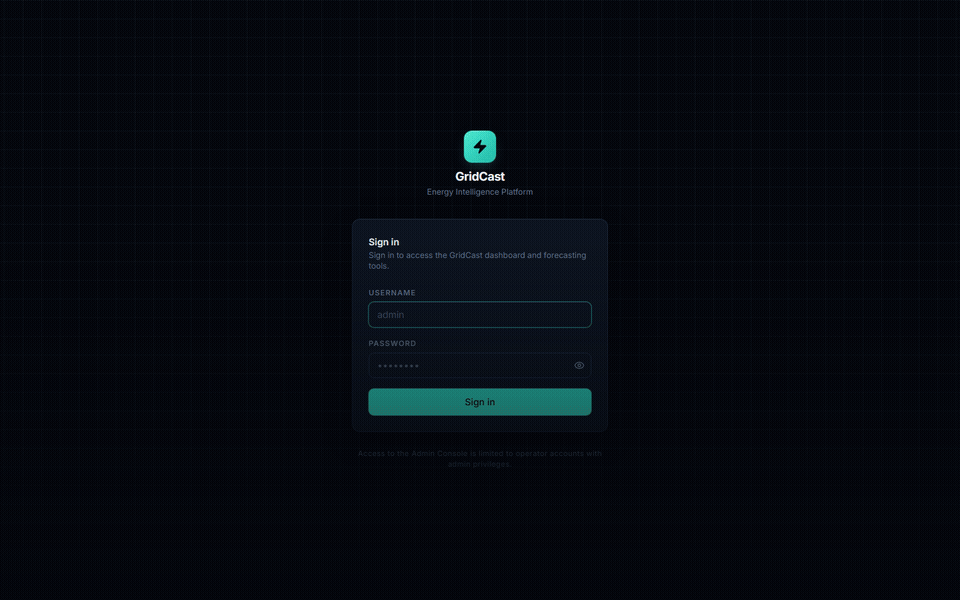
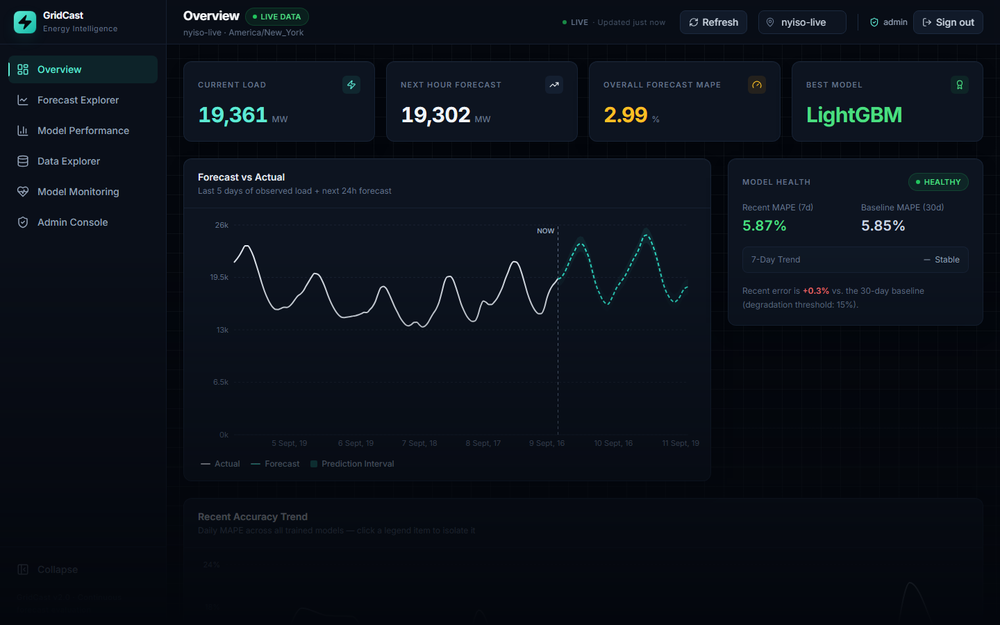
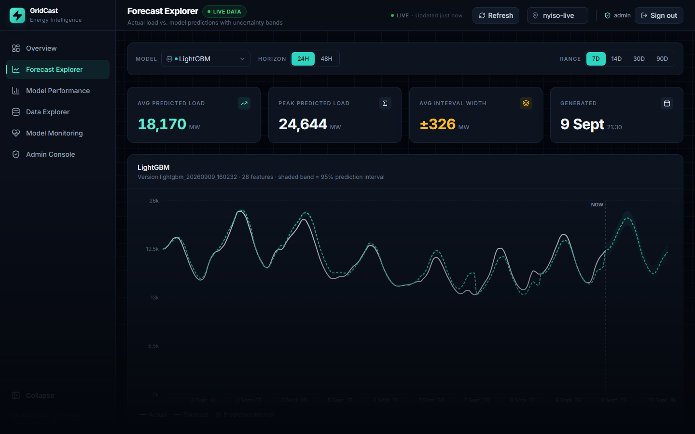
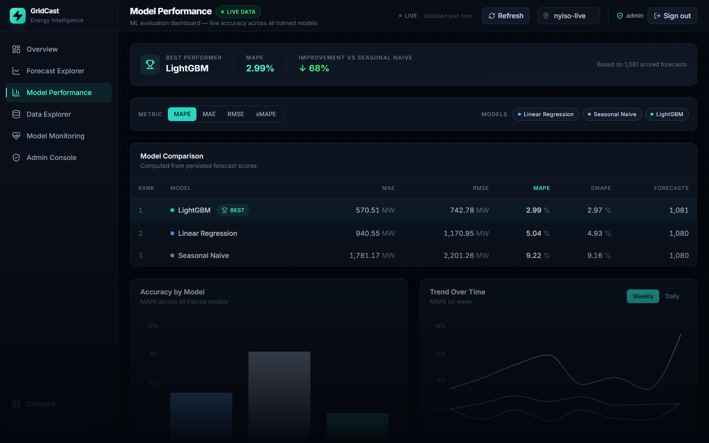
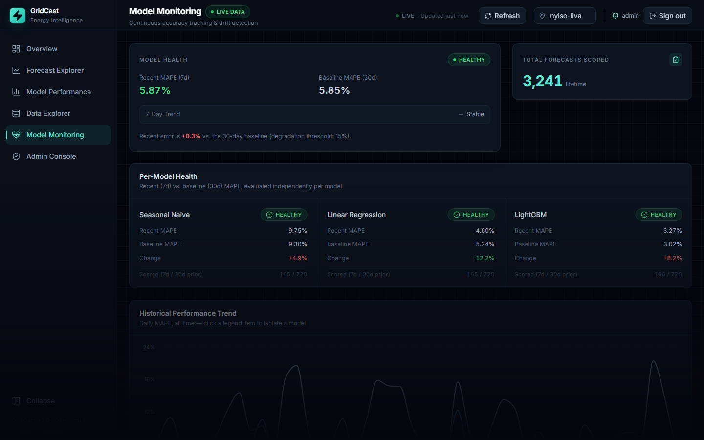

# ⚡ GridCast

An electricity demand forecasting platform that scores its own forecasts against reality as they come true, instead of just claiming to be accurate once.

[](https://www.python.org/)
[](https://react.dev/)
[](https://fastapi.tiangolo.com/)
[](https://www.postgresql.org/)
[](https://lightgbm.readthedocs.io/)
[](https://github.com/poojaaxx/gridcast)

### 🚀 [Live Demo](https://gridcast-frontend.onrender.com)

[](https://gridcast-frontend.onrender.com)

## What is GridCast?

GridCast forecasts hourly electricity demand for the NYISO grid, 24–48 hours out, using three different models. What makes it more than a forecasting script: every forecast is written to the database the moment it's made, and scored automatically once the real load for that hour actually shows up. That gives you an honest, continuously growing accuracy record instead of a single "look how good my model is" demo run — plus drift detection that flags when a model quietly starts getting worse.

The workflow, end to end: real load + weather data comes in → features get built → three models forecast the next 24–48h → forecasts get persisted → actuals arrive → forecasts get scored → models get compared → drift gets monitored. Repeat, every hour.

## Production Snapshot

Real screenshots from the deployed app, running against live NYISO data.

<p align="center">
  
  
</p>
<p align="center">
  
  
</p>

## Results

Real numbers from GridCast's own walk-forward evaluation against live NYISO load — not a curated demo.

| Model | MAPE | MAE | RMSE |
|---|---:|---:|---:|
| **LightGBM** 🏆 | **2.99%** | 571 MW | 743 MW |
| Linear Regression | 5.04% | 941 MW | 1,171 MW |
| Seasonal Naive | 9.22% | 1,781 MW | 2,201 MW |

LightGBM is the current best performer, beating the seasonal-naive baseline by about 68% on MAPE. These are results to date, not a promise about tomorrow — that's exactly why GridCast keeps scoring forecasts instead of stopping after one good run.

## How it works

1. Ingest hourly electricity load and weather.
2. Build leakage-safe lag, rolling, calendar, and weather features.
3. Train Seasonal Naive, Linear Regression, and LightGBM with walk-forward validation.
4. Generate 24–48h forecasts with prediction intervals.
5. Persist every forecast along with the model version that produced it.
6. Score forecasts once actuals arrive.
7. Compare models and monitor for error drift over time.

## Stack

- **Frontend** — React, TypeScript, Vite, Tailwind, Recharts
- **Backend** — FastAPI, SQLAlchemy, PostgreSQL
- **ML** — LightGBM, scikit-learn
- **Data** — EIA / NYISO (electricity), Open-Meteo (weather)
- **Deployment** — Render + Neon
- **Auth** — JWT HttpOnly session cookies, Argon2id password hashing, admin-only write access, audit logging

No secrets are committed to this repo — everything sensitive is supplied through environment variables.

## Run locally

```bash
git clone https://github.com/poojaaxx/gridcast.git
cd gridcast

docker compose up -d
docker compose exec backend alembic upgrade head
```

- Frontend: http://localhost:5173
- Backend: http://localhost:8000/docs

Runs in DEMO mode by default — synthetic data, no API keys required. See `.env.example` for switching to LIVE mode against real EIA data.
