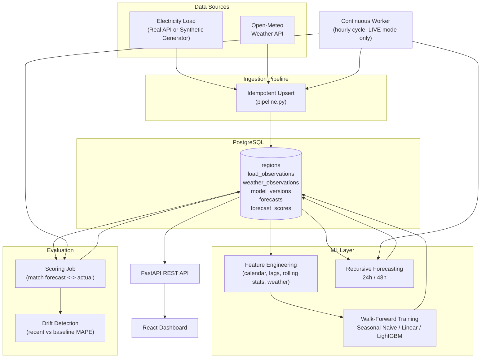
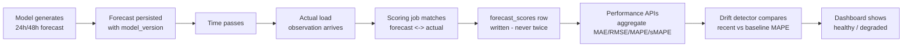
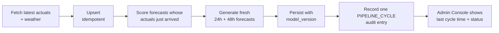
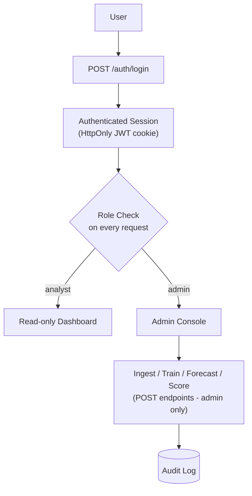

# GridCast

**Electricity Load Forecasting & Real-Time Model Evaluation Platform**

This is not just a forecasting model. It is a system that continuously generates predictions, persists them, evaluates them when actual observations arrive, and monitors whether model accuracy degrades over time.

GridCast ingests electricity demand and weather data, trains and version-controls multiple forecasting models, produces 24h/48h ahead forecasts, scores every forecast against reality as it arrives, and surfaces all of it — forecasts, errors, model comparisons, drift — in a dark, production-style analytics dashboard.

---

## Problem

Electricity grids must balance supply and demand *in real time*. Generation has to be scheduled hours to days in advance, but demand is only observed as it happens. Grid operators bridge that gap with forecasts: how much load will the grid need at 3pm tomorrow?

Electricity demand isn't random — it's highly structured:

- **Daily cycles** — an overnight trough, a morning ramp, a midday plateau, an evening peak.
- **Weekly cycles** — weekdays and weekends behave differently.
- **Weather sensitivity** — hot days drive air-conditioning load, cold days drive heating load.
- **Calendar effects** — holidays look nothing like a typical Tuesday.
- **Autocorrelation** — load an hour ago, a day ago, and a week ago are all informative.

That structure is exactly what makes load forecasting tractable with classical statistics and gradient-boosted trees — and exactly what a naive model (or a careless train/test split) can get catastrophically wrong.

## Why This Project Matters

Forecast error is not academic — it has a direct operating cost:

- **Under-forecasting** forces operators to buy emergency power on short notice, often at multiples of the normal price, or to lean on spinning reserves that burn fuel while idling.
- **Over-forecasting** wastes fuel and capacity that didn't need to be committed, and increases emissions for no delivered benefit.
- **Undetected model drift** is the quiet failure mode: a model that was accurate in March can quietly degrade by August as demand patterns shift, and nobody notices until the errors compound.

A forecasting model without a persistent, continuously-scored evaluation loop is a liability wearing the costume of a solution. GridCast's core design goal is to make that evaluation loop — not just the forecast — a first-class citizen of the system.

---

## Architecture



## Features

- **Provider-abstracted ingestion** — real electricity (EIA) + weather (Open-Meteo) APIs in LIVE mode; a deterministic synthetic generator in DEMO mode so the platform is always demoable with zero credentials. LIVE mode never silently falls back to synthetic data on failure - see [Data Sources](#data-sources).
- **Continuous hourly pipeline** — a dedicated worker container runs ingest → score → forecast every hour in LIVE mode - see [Continuous Pipeline](#continuous-pipeline).
- **Idempotent upserts** — re-running ingestion never duplicates a row (`UNIQUE(region_id, timestamp)` + conflict-safe inserts).
- **Leakage-safe feature engineering** — lag and rolling features are shifted before aggregation.
- **Three versioned forecasting models** — Seasonal Naive, Linear Regression, LightGBM.
- **Walk-forward (expanding window) validation** — no random splits, ever.
- **Recursive multi-step forecasting** — 24h/48h horizons, using predicted values (not future actuals) as lag inputs for later steps.
- **Simple Gaussian prediction intervals** from pooled validation residuals.
- **Full forecast persistence** — every forecast, with its model version, is permanently stored.
- **Automatic scoring** — forecasts are matched to actuals and scored exactly once.
- **Drift detection** — recent vs. baseline MAPE comparison with a configurable threshold.
- **Dark, data-dense analytics dashboard** — Overview, Forecast Explorer, Model Performance, Data Explorer, Model Monitoring.
- **One-command demo** — `make demo` goes from an empty database to a fully populated, three-model, continuously-scored dashboard.

## Tech Stack

| Layer | Technology |
|---|---|
| API | FastAPI, Pydantic v2, Uvicorn |
| ORM / Migrations | SQLAlchemy 2.0, Alembic |
| Database | PostgreSQL 16 |
| ML | pandas, numpy, scikit-learn, LightGBM, joblib, `holidays` |
| Frontend | React 18, TypeScript, Vite, Tailwind CSS, Recharts |
| Infra | Docker, Docker Compose, Makefile |

---

## Data Pipeline

```
Electricity Provider ─┐
                       ├─> Ingestion Pipeline ─> PostgreSQL (upsert, idempotent)
Weather Provider ──────┘
```

`app/ingestion/base.py` defines the provider interfaces:

```
ElectricityDataProvider
├── RealElectricityProvider     (EIA hourly demand API, requires EIA_API_KEY - see "Data Sources")
└── SyntheticElectricityProvider (deterministic, physically-plausible generator)

WeatherDataProvider
├── OpenMeteoWeatherProvider     (no API key required)
└── SyntheticWeatherProvider     (deterministic fallback)
```

**DEMO mode** (`ELECTRICITY_PROVIDER=synthetic`, the default) always uses the synthetic generator for load, so the whole platform works with zero credentials. Weather still prefers the real Open-Meteo provider even in demo mode (falling back to synthetic weather only if Open-Meteo itself fails), since real weather makes even synthetic load more realistic.

**LIVE mode** (`ELECTRICITY_PROVIDER=real`) is different by design: if the real electricity provider fails or returns nothing, ingestion **fails loudly** (`LiveProviderError` → HTTP 502) rather than silently substituting synthetic data under a "live" label. If real weather fails in LIVE mode, the run is marked `degraded` (zero weather rows, `weather_source: "unavailable"`) rather than fabricating a replacement. See [Live Mode](#live-mode) below.

Every fetched batch also passes through a validation gate (`app/ingestion/pipeline.py::validate_load_records` / `validate_weather_records`) before being written: missing timestamps, non-finite or negative load values, and duplicate timestamps within the same batch are rejected and counted (never invented or silently repaired) - the ingestion result reports rejection counts alongside insert/skip counts.

The synthetic generator (`app/ingestion/synthetic_provider.py`) is not random noise — it composes:

```
load(t) = base_load
        + hourly_seasonality(hour)        # morning ramp, evening peak, overnight dip
        + weekday_or_weekend_effect(day)
        + temperature_effect(temp)        # cooling above 22°C, heating below 10°C
        + long_term_trend(t)
        + seasonal_effect(day_of_year)
        + noise
```

seeded deterministically so the same date range always reproduces the same series.

Every ingestion run upserts via `INSERT ... ON CONFLICT DO NOTHING` against the `(region_id, timestamp)` unique constraint — re-running ingestion is always safe.

## Data Sources

### Electricity load — U.S. Energy Information Administration (EIA)

**Why not an Indian source.** Given GridCast's original brief, an Indian electricity-demand API (prioritizing Tamil Nadu / SRLDC, then another Indian state, then a national Indian source) was researched first. The two real candidates found were:

- **SRLDC / Grid-India** (`srldc.in`) — reachable, but real-time state demand is rendered into an HTML dashboard page, not exposed as a documented JSON/REST API. Scraping it would be fragile and its terms for automated, scheduled polling are unclear.
- **data.gov.in** (India's official open-data platform) — the underlying API gateway (`api.data.gov.in`) is genuinely live, but the dataset catalog is a JavaScript-rendered single-page app that couldn't be browsed from this project's tooling, and the catalog was showing a maintenance banner at research time. Even where CEA power-supply datasets do exist there, they have historically been daily supply-position summaries (demand met / shortage), not the hourly time series GridCast's models need.

Rather than scrape an uncertain source or fabricate one, EIA was selected as the documented fallback — a genuinely live, verified, hourly, deeply historical, credentialed-by-simple-API-key source, clearly labeled throughout the app as **U.S. grid data, not Indian**. A real Indian provider can be dropped in later as an additional `ElectricityDataProvider` (see [Future Improvements](#future-improvements)) without touching the rest of the pipeline.

| | |
|---|---|
| **Provider name** | `eia` (`app/ingestion/electricity_provider.py::RealElectricityProvider`) |
| **Official source** | [EIA Hourly Electric Grid Monitor](https://www.eia.gov/electricity/gridmonitor/) — API: `https://api.eia.gov/v2/electricity/rto/region-data` (Form EIA-930) |
| **What it provides** | Actual hourly electricity **demand** (`type=D` — filtered explicitly; the same endpoint also serves day-ahead demand *forecasts* and generation/interchange, which would corrupt a load series if left unfiltered) |
| **Region** | New York ISO (`respondent=NYIS`, configurable via `EIA_RESPONDENT_CODE`) — chosen because its coordinates coincide with GridCast's pre-existing default region geography |
| **Timestamp resolution** | Hourly, confirmed UTC-labeled by the endpoint's own metadata (`"alias": "hourly (UTC)"`) — no timezone guesswork |
| **Historical availability** | Back to 2019-01-01 (verified via the endpoint's metadata `startPeriod`) — over 67,000 hourly rows for this one respondent/type at last check |
| **Update frequency** | Hourly ("hourly live/ongoing data" — not sub-hourly, not "real-time" in the streaming sense) |
| **Required credentials** | Free API key: register at https://www.eia.gov/opendata/register.php, set `EIA_API_KEY` in `.env`. The shared `DEMO_KEY` also works for light, rate-limited testing (this is how the real end-to-end verification for this feature was performed) but is not meant for sustained production use. |
| **Limitations** | U.S. data only; a handful of very recent hours occasionally publish as `null` and are correctly rejected by validation rather than guessed at; EIA enforces a per-key rate limit (observed ~10 requests/minute), which the backfill task paces around. |

### Weather — Open-Meteo

Unchanged from the original design: `OpenMeteoWeatherProvider` (`app/ingestion/weather_provider.py`), no API key required, used in both LIVE and DEMO mode. The weather location always matches the electricity region's coordinates - for the live NYISO region that's New York City (40.7128, -74.0060); if `LIVE_REGION_LATITUDE`/`LIVE_REGION_LONGITUDE` are changed to track a different electricity region, weather automatically follows.

## Live Mode

1. Get a free EIA API key (or use `DEMO_KEY` for testing) and set in `.env`:
   ```bash
   ELECTRICITY_PROVIDER=real
   EIA_API_KEY=<your key>
   EIA_RESPONDENT_CODE=NYIS        # optional, this is the default
   ```
2. Restart the backend (`docker compose up -d --build backend`) — `data_mode` immediately reports `"live"` in `/health` and the Admin Console.
3. Backfill history (needed before training - models require ~60 days of joined load+weather history):
   ```bash
   make backfill-live   # python -m app.tasks.backfill_live
   ```
   Resumable, idempotent, and rate-limit-paced - safe to re-run or extend via `GRIDCAST_BACKFILL_START` / `GRIDCAST_BACKFILL_END` (ISO dates in `.env`), or `--start`/`--end`/`--chunk-days`/`--pace-seconds` CLI flags. Defaults to the trailing 90 days if no bounds are given (never a hardcoded date).
4. Train models and generate forecasts from the Admin Console (or `make train` / `make forecast`, pointed at the live region name).
5. Start the continuous pipeline (see below) so ingestion, scoring, and forecasting keep running hourly without manual intervention.

**The hard guarantee**: LIVE mode never silently substitutes synthetic data. A failing EIA request surfaces as a failed ingestion (502 from the API, a FAILURE audit log entry, a failed worker cycle) - never a quiet fallback that could be mistaken for real data. This is enforced in code (`app/ingestion/pipeline.py::fetch_load`) and covered by tests (`tests/test_live_provider.py`).

## Forecasting Models

| Model | Description |
|---|---|
| **Seasonal Naive** | `load(t) = load(t - 168h)` — same hour, same weekday, one week prior. The baseline every other model must beat. |
| **Linear Regression** | Calendar + weather + a handful of lag features, scaled with `StandardScaler`. |
| **LightGBM** | Full feature set — calendar, 7 lag features, rolling mean/std over 24/72/168h, weather, holiday flags. The primary production candidate. |

All three share the same `BaseForecastModel` interface (`fit` / `predict`) so training, walk-forward validation, and forecasting treat them interchangeably.

### Feature Engineering (`app/ml/features/`)

| Family | Features |
|---|---|
| Calendar | `hour`, `day_of_week`, `day_of_month`, `month`, `week_of_year`, `is_weekend`, `is_holiday` (via the `holidays` package), cyclical sin/cos of hour & day-of-week |
| Lag | `load_lag_{1,2,3,24,48,72,168}` |
| Rolling | `rolling_mean_{24,72,168}`, `rolling_std_{24,72}` — **computed on data shifted by 1 hour before the window is applied**, so a rolling stat at time *t* never includes `load[t]` |
| Weather | `temperature_c`, `humidity_percent`, `temperature_squared`, `cooling_degree_proxy`, `heating_degree_proxy` |

## Time-Series Validation

**Random train/test splits leak information.** If you shuffle hourly rows and split randomly, a model can train on data from *next month* and validate on *this month* — seeing patterns (trend, that specific week's weather) it could never have known about at prediction time. The reported accuracy would be fiction.

GridCast implements **walk-forward validation with expanding windows** (`app/ml/evaluation/walk_forward.py`):

```
Fold 1: TRAIN [Jan ... Mar)  VALIDATE [Mar ... Apr)
Fold 2: TRAIN [Jan ... Apr)  VALIDATE [Apr ... May)
Fold 3: TRAIN [Jan ... May)  VALIDATE [May ... Jun)
```

Each fold trains on everything strictly before the validation window and validates on the next contiguous block — exactly mirroring production usage (train on history, predict the near future). Every fold reports MAE / RMSE / MAPE / sMAPE; the training service stores per-fold metrics plus the mean and standard deviation across folds in `model_versions.metrics_json`.

MAPE and sMAPE are epsilon-protected against near-zero actuals:

```python
mape = mean(abs(actual - predicted) / max(abs(actual), epsilon)) * 100
```

## Continuous Evaluation

This is the heart of the platform.



A forecast is never overwritten and never scored twice (`UNIQUE(forecast_id)` on `forecast_scores`). This means the full history of "what did we predict, and how right were we" is always reconstructable straight from the database — which is exactly what the Forecast Explorer, Model Performance, and Model Monitoring pages read from.

### Drift Detection

`GET /evaluation/drift` compares mean MAPE over the last 7 days against the prior 30-day baseline:

```json
{
  "status": "healthy",
  "recent_mape": 4.2,
  "baseline_mape": 4.5,
  "change_percent": -6.7,
  "threshold_pct": 15.0
}
```

If `change_percent` exceeds `DRIFT_MAPE_DEGRADATION_THRESHOLD_PCT` (default 15%), status flips to `"degraded"`.

## Continuous Pipeline

```
INGEST → SCORE → FORECAST → PERSIST → MONITOR
```

`app/worker.py` is a dedicated container (`docker-compose.yml` service `worker`, same image as `backend`) that runs one full cycle every hour via `app/tasks/hourly_pipeline.py::run_cycle`:



Deliberately **not** Celery/Redis/Kafka - a plain sleep-until-the-next-hour loop in its own container is simpler to operate for "one thing, once an hour" and has no extra moving parts. Every step it calls (ingestion upsert, forecast unique constraint, scoring anti-join) is already idempotent, so the worker is safe to restart at any point - a restart mid-cycle just safely re-runs (and no-ops the already-completed parts of) the current hour.

The worker only runs cycles in **LIVE mode**. In DEMO mode it stays intentionally idle (checking every 5 minutes whether that's changed) - demo data progression is already driven explicitly via the Admin Console / `make simulate`, and having a background process silently keep advancing the demo region forever was never part of that design.

Failure handling per step, without corrupting existing state:

- **Electricity provider fails** → the cycle fails, is logged as a `PIPELINE_CYCLE` `failure` audit entry, and retries next hour. Previously ingested data is untouched.
- **Weather provider fails** → that run is marked degraded (no fabricated weather); load ingestion still proceeds.
- **Model training fails** (not part of the hourly cycle, but the same principle applies from the Admin Console) → the previous working model version is untouched; the new attempt is simply not saved.
- **Forecast generation fails for one model** → logged as a per-model error in the cycle summary; other models' forecasts for that hour still generate, and previously persisted forecasts are never overwritten.
- **Scoring fails** → the whole cycle fails rather than partially scoring, so `forecast_scores` can never end up in a half-written state; already-scored forecasts are never re-scored (idempotent by constraint).

Check pipeline health any time via `GET /admin/status` (`last_pipeline_cycle_at`, `last_pipeline_cycle_status`) or the Admin Console's System Status panel, and inspect individual cycles in **Audit Activity** (`action: "PIPELINE_CYCLE"`, `username: "system:worker"`).

To run a single cycle manually instead of waiting for the worker:

```bash
make pipeline-cycle   # python -m app.tasks.hourly_pipeline --region nyiso-live
```

---

## Dashboard

Dark, data-dense analytics UI built with React + Tailwind + Recharts.

| Page | Contents |
|---|---|
| **Overview** | KPI cards (current load, next-hour forecast, 24h MAPE, best model, health), forecast-vs-actual chart, recent accuracy trend |
| **Forecast Explorer** | Interactive chart — pick model, horizon (24h/48h), and date range; actual load, forecast line, and 95% prediction interval band |
| **Model Performance** | Full model comparison table (MAE/RMSE/MAPE/sMAPE), weekly MAPE trend, per-model MAE/RMSE bars, walk-forward fold-level error distribution |
| **Data Explorer** | Temperature-vs-load scatter, hourly load profile, weekly seasonality |
| **Model Monitoring** | Overall + per-model drift status, healthy/degraded indicators, all-time MAPE trend |

> Screenshots: `docs/screenshots/*.png` (add your own after running `make demo`).

The dashboard never fabricates data — every chart reads from the FastAPI backend. Every route (including the dashboard itself) requires signing in first (`/login` is the application's entry point); an authenticated non-admin sees an explicit empty state pointing them to ask an administrator, while a signed-in admin sees a **"Generate Demo Data"** action right there that ingests history, trains all three models, and generates initial forecasts.

There is also a dedicated **[Admin Console](#security--access-control)** (`/admin`, sign-in required) for running these same operations deliberately, one at a time, with full visibility into what happened.

---

## Security & Access Control

Signing in is required to use GridCast at all — `/login` is the application's entry point, and every other route redirects there if unauthenticated. Every read-only **API** endpoint (`GET /data/*`, `/forecasts/*`, `/evaluation/*`, `/models`, `/regions`) remains unauthenticated by design (so the backend itself can still be queried directly without a browser session), but the frontend never exposes them without a login. Everything that *writes* — ingesting data, training a model, generating a forecast, scoring evaluations — requires an authenticated **admin** session, enforced independently by the backend on every request (not just hidden in the React UI).



### Roles

| Role | Can do |
|---|---|
| `analyst` | Sign in and view every dashboard page. A real, separate role from `admin` in the schema so the boundary is provably enforced (see `tests/test_auth.py::test_protected_admin_endpoint_with_analyst_returns_403`) — no analyst accounts exist by default (only the bootstrapped admin), and there is no self-service registration; an admin would need to create one directly. |
| `admin` | Everything above, plus every mutating endpoint (`POST /data/ingest`, `/models/train`, `/forecasts/generate`, `/evaluation/score`, `/regions`) and the Admin Console (`/admin`). |

The underlying read-only `GET` API endpoints themselves stay unauthenticated at the HTTP level (matching the platform's original "public data API" design) - it's the frontend routing, not the API, that now requires a login for every page.

### How sessions work

- Passwords are hashed with **Argon2id** (via `argon2-cffi`) — never stored or returned in plaintext, and never included in any API response (see `UserOut`/`AuditLogOut` schemas).
- A successful login sets a short-lived (`JWT_EXPIRE_MINUTES`, default 8h), signed JWT in an **HttpOnly cookie** (`gridcast_session`). The frontend's JavaScript never reads or stores this token — no `localStorage`, no `Authorization` header to leak. This also means there's no refresh-token flow to build: the session simply expires after `JWT_EXPIRE_MINUTES` and the user signs in again. That's a deliberate simplicity trade-off for this project's scope; a longer-lived product would add refresh rotation.
- Every protected route independently re-derives the user from that cookie via a FastAPI dependency chain (`get_current_user` → `require_user` → `require_admin` in `app/api/deps.py`) and hits the database — there is no way to forge admin access by manipulating the frontend, since the frontend never decides authorization, only reflects it.
- A 401 from any request clears the frontend's local auth state and (for protected routes) redirects to `/login`; a 403 renders a real "Access denied" page rather than silently hiding content.

### Admin bootstrap

No hardcoded default credentials exist anywhere in the codebase. The first admin is created from environment variables:

```bash
GRIDCAST_ADMIN_USERNAME=admin
GRIDCAST_ADMIN_PASSWORD=<a strong password of your choosing>
```

Set these in `.env` and the backend creates that admin automatically on startup (idempotent — safe to leave set across every restart; it will never overwrite an existing account or create a duplicate). To bootstrap without restarting the server:

```bash
make create-admin   # python -m app.tasks.bootstrap_admin
```

**For any real deployment**, supply `GRIDCAST_ADMIN_PASSWORD` and `JWT_SECRET_KEY` through your platform's secret manager (not a committed `.env`), and generate `JWT_SECRET_KEY` with something like `openssl rand -hex 32`.

### CORS & security headers

- `CORS_ORIGINS` is an explicit allowlist (never `*`) — required anyway once cookies are involved, since `allow_credentials=True` and a wildcard origin are mutually exclusive in the CORS spec.
- Every response carries `X-Content-Type-Options: nosniff`, `X-Frame-Options: DENY`, and `Referrer-Policy: strict-origin-when-cross-origin`. No `Content-Security-Policy` is set — this API serves JSON only (the frontend is a separate SPA with its own build/serving pipeline), so a CSP here would add complexity without protecting anything real.
- `COOKIE_SECURE=false` and `COOKIE_SAMESITE=lax` are correct for local HTTP development (frontend/backend both on `localhost`, different ports — cookies key off the registrable domain, not the port, so `lax` covers this). **In production over HTTPS, set `COOKIE_SECURE=true`**; if the frontend and backend ever live on genuinely different domains, use `COOKIE_SAMESITE=none` (which requires `COOKIE_SECURE=true`).

### Login rate limiting

Failed login attempts are tracked in-memory per `(username, client IP)` and locked out after `LOGIN_RATE_LIMIT_MAX_ATTEMPTS` (default 10) within `LOGIN_RATE_LIMIT_WINDOW_SECONDS` (default 15 minutes) — enough to stop trivial brute-forcing without adding infrastructure. This is intentionally lightweight: it's process-local state, so it resets on restart and wouldn't coordinate across multiple backend replicas. The app runs as a single Uvicorn process today (see `docker-compose.yml`), so this is sufficient; a genuinely multi-instance deployment would want a shared store (Redis) for this instead, which was deliberately **not** introduced here to avoid infrastructure this project doesn't otherwise need.

### Audit log

Every admin action — login, logout, ingest, train, generate, score, region creation — writes an `audit_logs` row: who, what, when, and success/failure (with a small non-secret detail summary, e.g. record counts). It's visible in the Admin Console's **Audit Activity** panel and never stores passwords, tokens, or other secrets. Manual CLI tasks (`make seed`, `make train`, `make demo`, etc.) call the same services directly and bypass the HTTP/auth layer entirely — they are **not** audit-logged, since there's no authenticated request to attribute them to. The one exception is the continuous worker (see [Continuous Pipeline](#continuous-pipeline)): its hourly cycles run unattended in a live deployment, so each one writes a `PIPELINE_CYCLE` entry attributed to `username: "system:worker"` rather than being silent. Treat plain CLI commands as trusted local/operator actions, and the Admin Console + worker cycles as the audited path for anything that matters in a shared deployment.

### Live vs. demo data

`GET /health` and the Admin Console's System Status both expose `data_mode`: `"demo"` when `ELECTRICITY_PROVIDER=synthetic` (the default — see [Data Pipeline](#data-pipeline)), or `"live"` when a real provider is configured, plus which provider/region that is. The dashboard topbar shows this as a visible **Demo Data / Live Data** badge at all times (hover for provider/region) so synthetic data is never mistaken for a real feed. See [Live Mode](#live-mode) for the full setup, and [Data Sources](#data-sources) for exactly what "live" means today (EIA, U.S. grid data) and why. The hard rule, enforced in code and tested: **GridCast will never fabricate a live feed in place of a missing one** — a failing live provider is a failed operation, never a silent switch to synthetic data.

---

## Local Setup

Requires Docker + Docker Compose.

```bash
git clone <this-repo>
cd gridcast
cp .env.example .env

make setup     # builds images
make up        # starts postgres, backend, frontend
make migrate   # applies Alembic migrations
```

- Frontend: http://localhost:5173
- Backend / API docs: http://localhost:8000/docs

Create your first admin (see [Security & Access Control](#security--access-control)):

```bash
# Set GRIDCAST_ADMIN_USERNAME / GRIDCAST_ADMIN_PASSWORD in .env, then either
# restart the backend (it bootstraps automatically) or run:
make create-admin
```

Then sign in at http://localhost:5173/login and populate data from the Admin Console, or use the CLI:

```bash
make seed       # ingest ~180 days of load + weather
make train      # train seasonal naive, linear regression, lightgbm
make forecast   # generate 24h + 48h forecasts
make score      # score forecasts against arrived actuals
```

## Demo Mode

For a fully populated dashboard in one shot:

```bash
make demo
```

This runs `app.tasks.bootstrap_demo`, which:

1. Creates the demo region (idempotent).
2. Ingests ~200 days of synthetic load + weather history.
3. Trains all three models with walk-forward validation.
4. Generates initial 24h/48h forecasts from each.
5. **Simulates 72 hours of live production operation** — advancing time hour by hour, inserting new actuals, issuing fresh forecasts, and scoring previous ones as they come due.
6. Runs a final scoring pass.

Afterwards, open http://localhost:5173 — every page will have real, persisted data to show, including a genuine accuracy history built from actual scoring events (not backfilled fake numbers).

To keep simulating live operation later:

```bash
make simulate   # python -m app.tasks.simulate_live --region demo-region --hours 72
```

## API Documentation

Interactive OpenAPI docs: **http://localhost:8000/docs**

Key endpoints (🔒 = requires an authenticated admin session; everything else is public):

```
GET  /health                       data_mode: "live"|"demo", electricity_provider, region

POST /auth/login                   {username, password} - sets HttpOnly session cookie
POST /auth/logout
GET  /auth/me                      current session's user, or 401

GET  /regions                      🔒 POST /regions
GET  /data/load?region=&start=&end=
GET  /data/weather?region=&start=&end=
🔒 POST /data/ingest                  {region, days} - 502 if LIVE mode's provider fails (never a silent fallback)
GET  /models                       GET /models/{id}
🔒 POST /models/train                 {region, model_type}
🔒 POST /forecasts/generate           {region, model_version, horizon_hours}
GET  /forecasts/latest?region=
GET  /forecasts/history?region=
🔒 POST /evaluation/score             {region}
GET  /evaluation/summary?region=
GET  /evaluation/timeseries?region=&granularity=day|week
GET  /evaluation/model-comparison?region=
GET  /evaluation/drift?region=&model_type=

🔒 GET /admin/status                  environment, data_mode, provider, live/demo region,
                                       last ingest/forecast/eval/pipeline-cycle timestamps
🔒 GET /admin/audit-log?limit=
```

## Project Structure

```
gridcast/
├── backend/
│   ├── app/
│   │   ├── api/
│   │   │   ├── routes/       # FastAPI routers (incl. auth.py, admin.py)
│   │   │   └── deps.py       # get_current_user / require_user / require_admin
│   │   ├── core/             # config, logging, security.py (hashing + JWT)
│   │   ├── db/                # engine/session, declarative base
│   │   ├── models/           # SQLAlchemy ORM models (incl. User, AuditLog)
│   │   ├── schemas/          # Pydantic request/response models
│   │   ├── ingestion/        # provider abstraction + pipeline
│   │   ├── ml/
│   │   │   ├── features/     # calendar, lag, rolling, weather features
│   │   │   ├── models/       # seasonal naive, linear, lightgbm
│   │   │   └── evaluation/   # metrics, walk-forward validation
│   │   ├── services/         # training, forecasting, evaluation, auth, audit
│   │   ├── tasks/            # CLI entry points (train_all, bootstrap_admin,
│   │   │                     #   backfill_live, hourly_pipeline, ...)
│   │   ├── worker.py         # continuous hourly scheduler (docker-compose `worker` service)
│   │   └── utils/
│   ├── alembic/               # migrations
│   └── tests/                 # incl. test_auth.py, test_live_provider.py
├── frontend/
│   └── src/
│       ├── components/       # MetricCard, ForecastChart, ProtectedRoute, ConfirmDialog, ...
│       ├── pages/            # Overview, ForecastExplorer, ..., Login, Admin
│       ├── services/api.ts   # typed API client (credentials: "include")
│       ├── state/            # RegionProvider, AuthProvider, demo bootstrap hook
│       └── types/
├── data/models/               # trained model artifacts (joblib)
├── docker-compose.yml
├── Makefile
└── .env.example
```

## Testing

```bash
make test   # runs pytest inside the backend container
```

Pure unit tests (no database required):

- **Features** — lag features only reference past rows; rolling stats are provably unaffected by mutating the current row.
- **Models** — Seasonal Naive returns exactly `load_lag_168`; expanding-window splits preserve chronological order (train always precedes validation, training window strictly expands).
- **Metrics** — MAPE/sMAPE never divide by zero near-zero actuals.

Database-backed tests (require Postgres — run automatically in the backend container, or via `docker compose up -d postgres` locally):

- **Ingestion** — re-ingesting identical records inserts zero duplicates; partial-overlap batches insert only the new rows; the DB-level unique constraint rejects duplicate `(region_id, timestamp)` rows.
- **Evaluation** — a forecast is scored against the correct matching actual; a forecast can never be scored twice, even across repeated scoring runs.
- **Auth** (`test_auth.py`) — login success/invalid password/unknown user/inactive user; a protected endpoint returns 401 unauthenticated and 403 for a non-admin; an admin can reach it; logout and `/auth/me` behave correctly; admin bootstrap is idempotent; password hashes are never returned in any response; audit log rows are created for login/admin actions and never contain secrets.
- **Live provider** (`test_live_provider.py`, all EIA HTTP calls mocked - no real network needed to run these) — EIA rows normalize into UTC `LoadRecord`s; malformed/`null`/negative rows are rejected without inventing values; pagination correctly walks beyond a single 5000-row page; a provider HTTP failure raises; **LIVE mode raises `LiveProviderError` instead of falling back to synthetic data**, both on a hard failure and on an empty response; **DEMO mode never even attempts to call the real provider**; the validation gate rejects duplicate/invalid load and weather records; historical backfill is idempotent across repeated runs; the `/data/ingest` route maps a live-provider failure to a clean `502`, not a raw `500`.

## Production Deployment

**Status: deployment preparation complete; external deployment step remains.** Everything that can be prepared from inside this repository - a Render Blueprint, a production-ready Dockerfile, exact manual steps, and this documentation - is done. There is no live public URL yet: creating the hosting/database accounts, entering the EIA API key and admin credentials, and clicking "Deploy" are actions only you can take (an assistant with only local shell/file access cannot sign up for external services on your behalf).

### Architecture

```
Frontend (Render Static Site, free, CDN + HTTPS)
        │  HTTPS fetch, credentials: include
        ▼
Backend (Render Web Service, free — FastAPI, existing Dockerfile)
        │                                    │
        ▼                                    ▼
Neon Postgres (free, persistent)   Worker (Render Background Worker, free —
                                    same image, `python -m app.worker`)
```

| Component | Platform | Why |
|---|---|---|
| Frontend | Render Static Site | Free, no spin-down, global CDN + HTTPS included - a pure static Vite build needs nothing more. |
| Backend | Render Web Service (Docker, free) | Reuses the existing `backend/Dockerfile` unmodified in spirit (only the port-binding line changed - see below). |
| Worker | Render Background Worker (Docker, free) | Same image as the backend, different start command (`python -m app.worker`) - the continuous hourly pipeline. |
| Database | [Neon](https://neon.tech) Postgres (free) | Chosen over Render's own free Postgres specifically because Render's free Postgres **auto-deletes after 30 days + a 14-day grace period** - unacceptable for data this project is supposed to actually accumulate. Neon's free tier never expires (compute auto-suspends when idle and auto-resumes transparently on the next query; the data itself is never deleted). |

This decision - and the free-tier limitation below - came from checking each platform's currently published terms (Render, Railway, Fly.io, Neon, Supabase), not from assumption; see commit history for the specifics.

### Known limitation: the free-tier worker is not guaranteed 24/7

Render's free tier gives each workspace a shared pool of **750 instance-hours/month across every free service in it**. A background worker that never sleeps consumes roughly 730-744 of those hours by itself in a 31-day month, leaving very little headroom for the backend web service sharing the same pool. Render's own community documentation confirms that once a workspace's free instance-hours are exhausted, **all of that workspace's free services are suspended until the hour count resets at the start of the next calendar month** - there's no automatic fallback to billing.

Practically: this deployment may see the worker (or backend) suspended for the last several days of some months, which pauses the hourly pipeline until the reset. This is a disclosed trade-off of using the genuinely-free tier, not a bug - upgrading `gridcast-backend` and `gridcast-worker` to Render's Starter plan (~$7/mo each, ~$14/mo total) removes the shared pool entirely and gives both real 24/7 uptime. That upgrade was not made automatically since it requires payment approval.

### Manual steps (required - I cannot do these for you)

1. **Create a free Neon account** at https://neon.tech (no credit card required) and create a project/database (e.g. named `gridcast`). Copy its connection string - it looks like `postgresql://<user>:<password>@<host>.neon.tech/<db>?sslmode=require`.
2. **Register a free EIA API key** at https://www.eia.gov/opendata/register.php.
3. **Generate a JWT secret**: run `openssl rand -hex 32` locally and copy the output.
4. **Choose a production admin username and a strong, unique password** - you'll type these directly into Render's dashboard, never into a file or this repo.
5. **Create a Render account** at https://render.com and connect your GitHub account.
6. In Render, choose **New → Blueprint**, point it at `poojaaxx/gridcast`. Render reads `render.yaml` from the repo root and proposes three services: `gridcast-frontend`, `gridcast-backend`, `gridcast-worker`.
7. When Render prompts for the environment variables marked secret in `render.yaml` (`DATABASE_URL`, `JWT_SECRET_KEY`, `GRIDCAST_ADMIN_USERNAME`, `GRIDCAST_ADMIN_PASSWORD`, `EIA_API_KEY`), paste in the values from steps 1-4. **`DATABASE_URL`, `JWT_SECRET_KEY`, and `EIA_API_KEY` must be entered identically for both `gridcast-backend` and `gridcast-worker`.**
8. Click **Deploy**.
9. Once `gridcast-backend` and `gridcast-frontend` have real URLs, confirm they match the defaults baked into `render.yaml` (`https://gridcast-backend.onrender.com`, `https://gridcast-frontend.onrender.com`). If Render assigned different subdomains (e.g. those exact names were already taken), update `CORS_ORIGINS` on the backend service and `VITE_API_BASE_URL` on the frontend service in the Render dashboard to the real URLs, then trigger a manual redeploy of the frontend (its API URL is baked in at build time, so a plain env var change alone won't take effect).
10. Once the backend is live and healthy, open its **Shell** tab in the Render dashboard and run a one-time bootstrap:
    ```bash
    python -m app.tasks.backfill_live      # ~90 days of real NYISO history by default
    python -m app.tasks.train_all --region nyiso-live
    ```
    After this, the worker takes over hourly ingestion, forecasting, and scoring on its own - see [Continuous Pipeline](#continuous-pipeline).

### What was prepared automatically (no account needed)

- **`render.yaml`** - the full three-service Blueprint described above, with every secret marked `sync: false` so Render prompts for it once in its dashboard rather than storing it in this file or Git.
- **`backend/Dockerfile`** - the only functional change: the container now binds to `$PORT` (falling back to `8000` when unset, so local `docker-compose` is unaffected) instead of a hardcoded port, since Render assigns the port dynamically at runtime. It also now runs `alembic upgrade head` before starting, so migrations apply automatically on every deploy without a separate manual step.
- **Production CORS/cookie values**, set directly in `render.yaml`: an explicit single-origin CORS allowlist (never `*`), `COOKIE_SECURE=true`, and `COOKIE_SAMESITE=none`. The last one is required specifically because `onrender.com` is on the [Public Suffix List](https://publicsuffix.org/) - `gridcast-frontend.onrender.com` and `gridcast-backend.onrender.com` are treated by browsers as different sites despite sharing a base domain, so `SameSite=Lax` (correct for local dev, where both run on `localhost`) would silently block the session cookie on the frontend's cross-site `fetch()` calls in production.
- **`ELECTRICITY_PROVIDER=real`** set for both the backend and worker in `render.yaml` - production is configured for LIVE data (EIA/NYISO) from the start, never defaulting to `synthetic`.

### Environment variables reference

| Variable | Where it's used | Notes |
|---|---|---|
| `DATABASE_URL` | backend, worker | Neon connection string. Never committed - `sync: false` in `render.yaml`. |
| `JWT_SECRET_KEY` | backend, worker | `openssl rand -hex 32`. Required - the app refuses to start without it (see [Security & Access Control](#security--access-control)). |
| `GRIDCAST_ADMIN_USERNAME` / `GRIDCAST_ADMIN_PASSWORD` | backend | Existing idempotent bootstrap mechanism - see [Admin bootstrap](#admin-bootstrap). No new/hardcoded admin was introduced for deployment. |
| `EIA_API_KEY` | backend, worker | Free key from EIA - see [Data Sources](#data-sources). |
| `ELECTRICITY_PROVIDER` | backend, worker | Set to `real` in `render.yaml` - this is the project's existing single source of truth for `data_mode` (there is no separate `GRIDCAST_DATA_MODE` flag that could disagree with it). |
| `EIA_RESPONDENT_CODE` | backend, worker | `NYIS` (New York ISO) - the region name is `LIVE_REGION_NAME` (default `nyiso-live`), not a separate `GRIDCAST_REGION` flag, for the same single-source-of-truth reason. |
| `CORS_ORIGINS` | backend | The frontend's exact public URL - see the cross-site cookie note above. |
| `COOKIE_SECURE` / `COOKIE_SAMESITE` | backend | `true` / `none` in production (HTTPS + cross-subdomain), `false` / `lax` for local dev. |

### Security in production

Every existing protection is preserved unmodified, not weakened for deployment convenience: Argon2id password hashing, HttpOnly JWT session cookie (now also `Secure=true`), the required (non-optional) `JWT_SECRET_KEY`, independent backend authorization on every mutating endpoint, the audit log, and the explicit CORS allowlist. See [Security & Access Control](#security--access-control) for the full design - none of it is deployment-specific.

### Live data in production

Production is configured for `ELECTRICITY_PROVIDER=real` - **live NYISO demand data from the U.S. Energy Information Administration**, not synthetic data and not Indian/Tamil Nadu data (see [Data Sources](#data-sources) for why EIA was selected). The Admin Console and dashboard badge both surface this accurately (`data_mode: "live"`, provider `eia`, region `nyiso-live`). If the EIA provider fails in production, the existing no-silent-fallback rule applies exactly as in any other environment: the operation fails, previously ingested data is preserved untouched, and nothing is fabricated in its place.

### Limitations of this deployment

- **Free-tier worker uptime is not guaranteed** - see above. Watch the Admin Console's "last pipeline cycle" timestamp; if it goes stale for more than a couple of hours, the workspace has likely hit its monthly free-hour cap.
- **Backend cold starts**: the free web service spins down after 15 minutes without HTTP traffic; the first request afterward takes roughly 30-50 seconds.
- **Cross-site session cookies**: `SameSite=None; Secure` is honored by all current major browsers, but browsers' third-party-cookie policies keep evolving. Moving the frontend and backend under one real registrable domain (e.g. `app.example.com` + `api.example.com` via a custom domain - not required initially, see Render's custom domain docs) would make the cookie same-site again and remove this category of risk entirely.
- No load balancing or multi-region failover; the static frontend gets a CDN via Render, the API does not.
- This is U.S. grid data (NYISO), not Indian - documented repeatedly and deliberately, since the original brief prioritized an Indian source that could not be verified as available (see [Data Sources](#data-sources)).

## Future Improvements

- A genuine Indian electricity-demand provider once one can be verified as a stable, machine-readable, ToS-compliant API (see [Data Sources](#data-sources) for what was researched and why EIA was used instead) — drops in as one more `ElectricityDataProvider`, no pipeline changes needed
- Quantile regression / full probabilistic forecasting (beyond Gaussian residual intervals)
- SHAP-based explainability for the LightGBM model
- MLflow experiment tracking in place of the current `model_versions` table
- Cloud deployment (ECS/Cloud Run + managed Postgres), including running the `worker` service as a managed scheduled job instead of a long-lived container
- Multi-region support with per-region model selection (the pipeline already supports multiple regions; only the Admin Console's single "target region" field and the worker's single configured live region are current limitations)
- Redis-backed login rate limiting for genuinely multi-instance deployments (today's in-memory limiter is single-process by design)
- Refresh-token rotation for longer-lived sessions without lengthening the access token's blast radius
- Per-action audit metadata for CLI-triggered operations (`make demo`, `make train`, ...), which currently bypass the HTTP/audit layer entirely (the continuous worker is the one exception - see [Continuous Pipeline](#continuous-pipeline))
- Explicit gap-detection across the historical series (today's ingestion window and hourly worker naturally re-cover recently-missed hours, but a long outage isn't proactively flagged)
